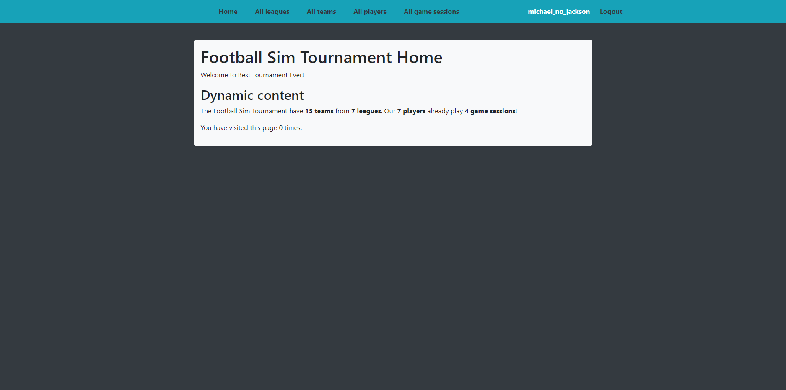

# Football simulator tournament

Django project for managing game session in Champion League football simulator

## Check it out!

[Football simulator tournament project deployed to render](https://football-simulator-tournament.onrender.com)

You can use following user:
- Login: michael_no_jackson
- Password: 1qazxcde3

## Installation

Python3 must be already installed

```shell
git clone <link>
cd football-simulator-tournament
python3 -m venv venv
source venv/bin/activate
pip install -r requirements.txt
python manage.py runserver  # starts Django Server
```

## Features

* Authentication functionality for Player/User
* Managing game session, team, leagues and players directly from website interface
* Powerful admin panel for advanced managing

## Demo


